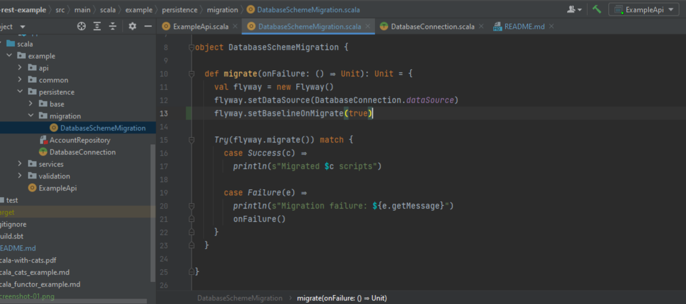
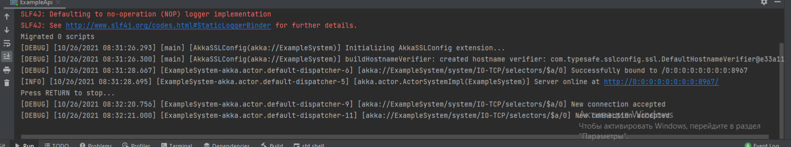
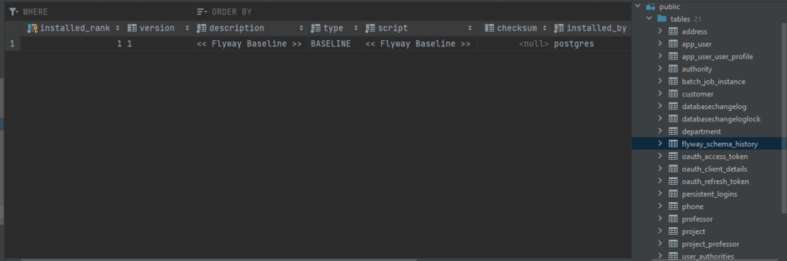
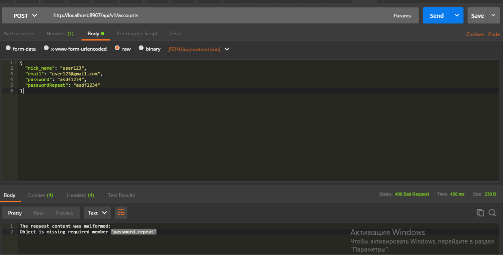
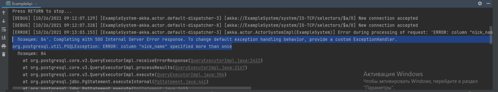
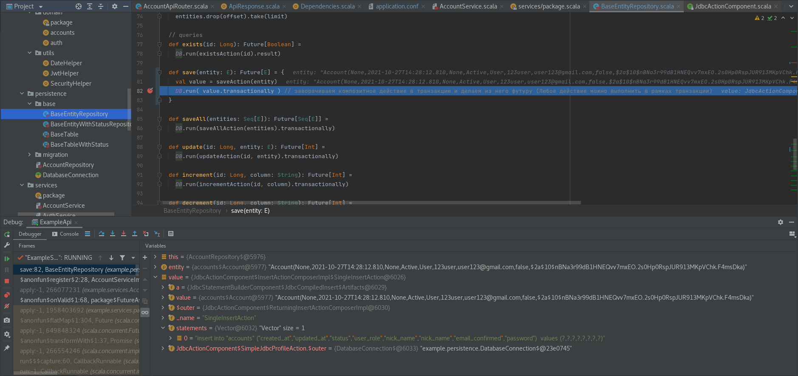
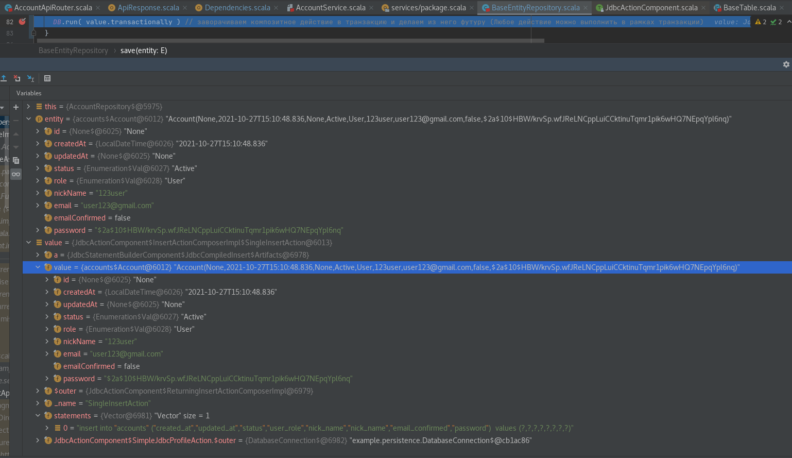
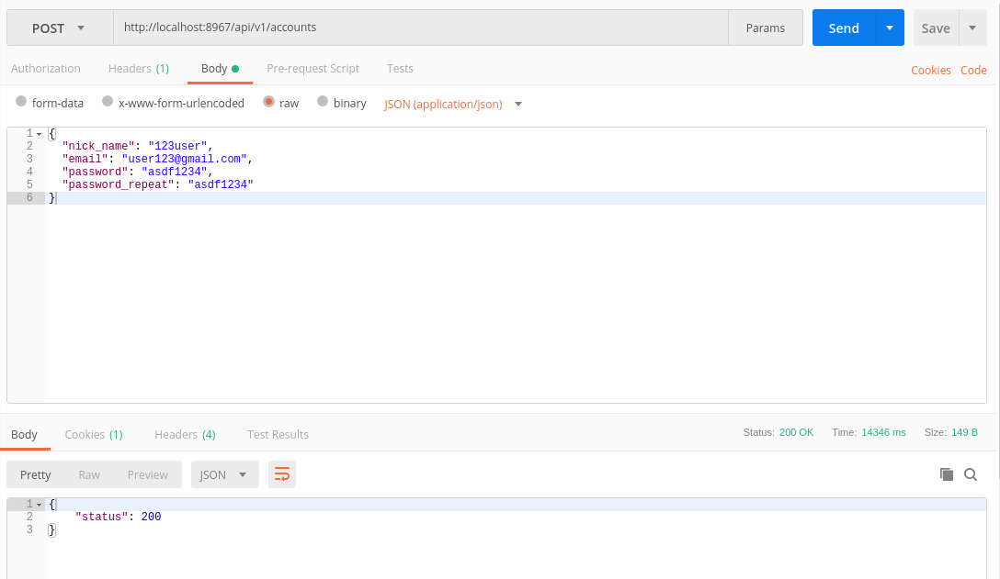
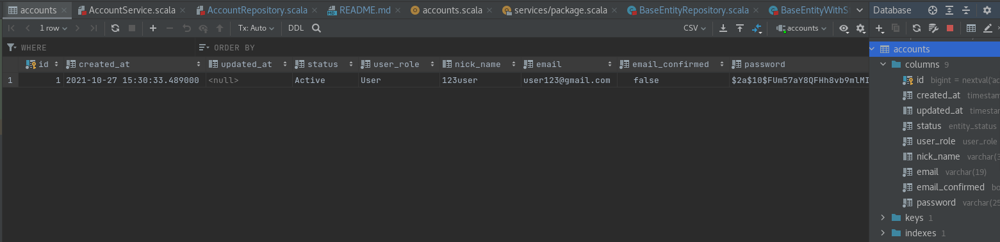

## Example REST API backend

* `Repo` https://github.com/shadowsmind/akka-http-rest-example

Used:
 * [Scala](http://scala-lang.org/)
 * [Sbt](scala-sbt.org)
 * [MacWire](https://github.com/adamw/macwire)
 * [Akka](http://akka.io/)
 * [Spray JSON](http://spray.io/)
 * [Cats](https://typelevel.org/cats/)
 * [Slick](http://slick.lightbend.com/)
 * [Flyway](https://flywaydb.org)


 * [Docker](https://www.docker.com/)
 * [PostgreSQL](https://www.postgresql.org/)
 
 
For more details about project structure, logic and libs see [STRUCTURE.md](./docs/STRUCTURE.md)

For pipeline example see [PIPELINE.md](./docs/PIPELINE.md)

[](https://www.youtube.com/watch?v=oqI_g2xm8uw)

```sql
--
-- TYPES
--
CREATE TYPE entity_status AS ENUM ('Active', 'Banned', 'Deleted');
CREATE TYPE user_role AS ENUM ('Admin', 'Editor', 'User');

--
-- TABLES
--
CREATE TABLE accounts (
  id              BIGSERIAL     NOT NULL,
  created_at      TIMESTAMP     NOT NULL DEFAULT now(),
  updated_at      TIMESTAMP              DEFAULT NULL,
  status          entity_status NOT NULL DEFAULT 'Active',
  user_role       user_role     NOT NULL DEFAULT 'User',
  nick_name       VARCHAR(35)   NOT NULL,
  email           VARCHAR(19)   NOT NULL,
  email_confirmed BOOLEAN       NOT NULL DEFAULT FALSE,
  password        VARCHAR(255)  NOT NULL
);

--
-- Primary Keys
--
ALTER TABLE ONLY accounts  ADD CONSTRAINT pk_accounts  PRIMARY KEY (id);

--
-- Indexes
--
ALTER TABLE ONLY accounts ADD CONSTRAINT uk_accounts__nick_name  UNIQUE (nick_name);
ALTER TABLE ONLY accounts ADD CONSTRAINT uk_accounts__email      UNIQUE (email);
```

# Migration failure: Found non-empty schema(s) "public" without schema history table! Use baseline() or set baselineOnMigrate to true to initialize the schema history table.

`Ошибка миграции: обнаружены непустые схемы "общедоступные" без таблицы истории схем! Используйте baseline () или установите для baselineOnMigrate значение true, чтобы инициализировать таблицу истории схемы.`







`GET` http://localhost:8967/api/v1/health
```json
{
  "status": 200
}
```




`POST` http://localhost:8967/api/v1/accounts
```json
{
  "nick_name": "user123",
  "email": "user123@gmail.com",
  "password": "asdf1234",
  "passwordRepeat": "asdf1234"
}
```

```text
The request content was malformed:
Object is missing required member 'password_repeat'
```




`POST` http://localhost:8967/api/v1/accounts
```json
{
  "nick_name": "user123",
  "email": "user123@gmail.com",
  "password": "asdf1234",
  "password_repeat": "asdf1234"
}
```
```json
{
    "status": 200
}
```








